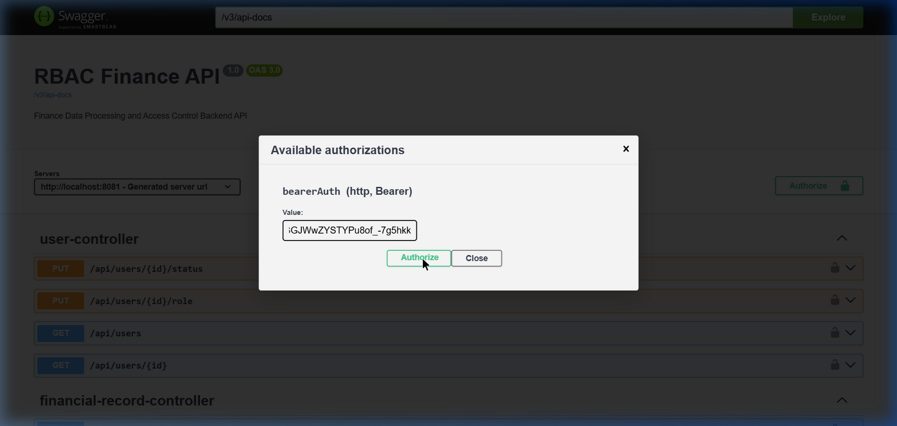

<div align="center">
  <h1 align="center">Finance Dashboard Backend API 💰</h1>
  <h3>Role-Based Access Control financial data processing system built with Spring Boot</h3>
  
  <p>
    <a href="https://github.com/nilesrathore22/rbac-finance-backend"></a>
    <a href="https://github.com/nilesrathore22/rbac-finance-backend"></a>
    <a href="./LICENSE"></a>
    <br>
    <br>
    <a href="#"></a>
  </p>
  
  <p>
    
  </p>
</div>

---

## 📌 Overview
The **Finance Dashboard Backend** provides a secure, role-based architecture for managing multi-tier access to financial records and summary aggregations. It validates JWT tokens, handles pagination, enforces global exception policies, and exposes an automated OpenAPI specification.

## 🚀 Public Live API
To let reviewers explore the backend without pulling code, the latest release is permanently deployed via Docker containerization.

👉 **[View Live OpenAPI / Swagger Documentation Here](#)** *(Note: Replace `#` with your actual Railway/Render URL)*

## 🏗️ Project Structure
```text
src/main/java/com/rbac/finance/
├── config/              # Security and OpenAPI configurations
├── controller/          # REST Endpoints (Auth, Records, Dashboard)
├── dto/                 # Data Transfer Objects
├── model/               # JPA Entities
├── repository/          # Spring Data Repositories
├── security/            # JWT Filters and Error Handlers
└── service/             # Business Logic and Aggregation Flow
```

## 📸 Demonstration
Below are functional snapshots of the system actively responding to assignments constraints inside our Swagger UI documentation.

### 1. User Registration & Authentication (JWT)
*Creating an administrative user and retrieving the stateless JSON Web Token.*


### 2. Authorization Security
*Swagger UI configured to inject the Bearer token globally into request headers.*


### 3. Record Management (Role-Protected CRUD)
*Admin secure insert payload targeting the Postgres database.*


### 4. Aggregated Dashboard Data
*Viewer-accessible endpoint summarizing SQL totals and analytics.*


## 🛠️ Local Setup Instructions

1. **Database Configuration**
   Make sure you have Docker installed. We have provided a `docker-compose.yml` to automatically initialize the PostgreSQL environment.
   ```bash
   docker-compose up -d
   ```
2. **Booting the Application**
   ```bash
   ./mvnw spring-boot:run
   ```
3. **Local Docs**
   Navigate locally to `http://localhost:8081/swagger-ui/index.html`

## 👨‍💻 Author & License
**Developed by [Nilesh Rathore](https://github.com/nilesrathore22)**  
This project is licensed under the [MIT License](LICENSE) - see the LICENSE file for details.
