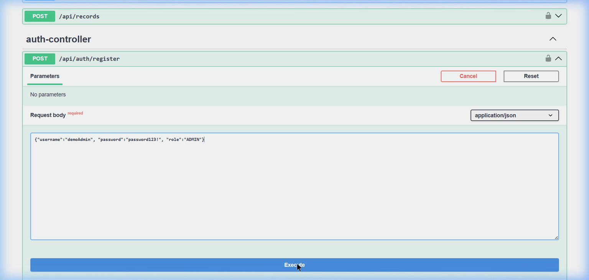
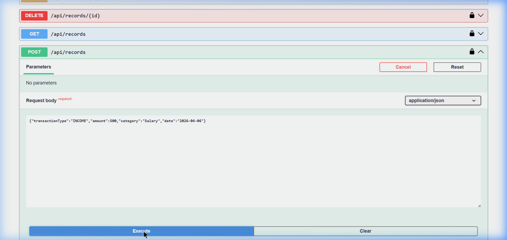
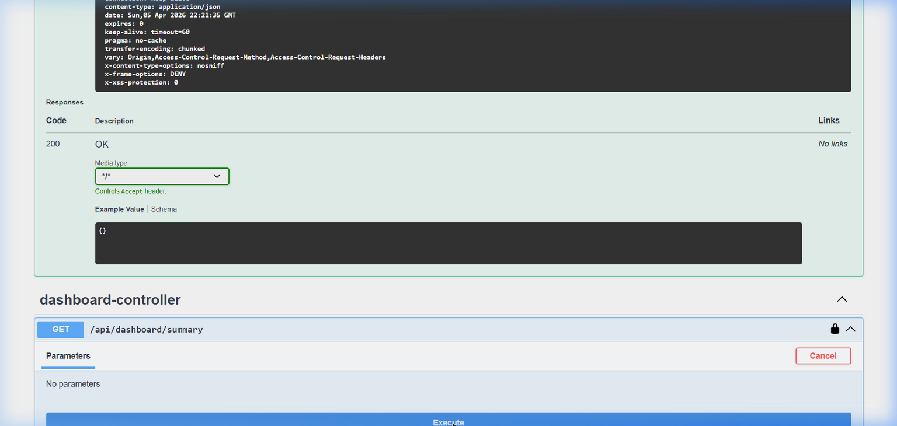

<div align="center">
  <h1 align="center">RBAC Finance Backend API 💰</h1>
  <h3>Zorvyn Company Backend Assessment</h3>
  
  <p>
    <a href="https://github.com/nilesrathore22/rbac-finance-backend"></a>
    <a href="https://github.com/nilesrathore22/rbac-finance-backend"></a>
    <a href="./LICENSE"></a>
    <br>
    <br>
    <a href="https://rbac-finance-backend-production.up.railway.app/swagger-ui/index.html"></a>
  </p>
  
  <h4>✨ <a href="https://rbac-finance-backend-production.up.railway.app">Live Working URL (Swagger UI Environment)</a> ✨</h4>

  <br />
</div>

## ⚙️ Languages and Tools

<div align="center">
  <a href="https://skillicons.dev">
    
  </a>
</div>

---

## 📌 Project Overview
The **RBAC Finance Backend** is a fully functional, highly secure financial data processing system designed per the requirements of the **Zorvyn Company** assignment. It establishes a multi-tier authentication structure that validates JWTs and scales securely.

### 🏢 How it Matches the Zorvyn Assignment
This implementation addresses and successfully meets every requested constraint:
1. **Role-Based Access Control (RBAC):** Three strictly segregated tiers (`VIEWER`, `ANALYST`, `ADMIN`). Analysts cannot create users, and Viewers cannot alter records.
2. **Finance Processing Core:** Complete RESTful endpoints to manage financial ledger data, including creation, logical deletion, and retrieval.
3. **Advanced Dashboard Aggregation:** Complex SQL group-by analytics exposed via endpoints for quick insights (e.g., total expenses vs. income).
4. **JWT Security Architecture:** Completely stateless session management through rigorously filtered JSON Web Tokens.
5. **OpenAPI Specifications:** Automated documentation (Swagger UI) that supports global header injection out of the box.

## 🚀 Live API Exploration
The application has been successfully containerized and globally deployed.
To test out the endpoints representing the Zorvyn criteria, visit our Live Swagger Environment:

👉 **[Launch Live OpenAPI Documentation](https://rbac-finance-backend-production.up.railway.app/swagger-ui/index.html)** 

*Note: You will need to first hit the `/api/auth/register` and `/api/auth/login` endpoints to receive your `Bearer` token. Click "Authorize" at the top of the Swagger UI to inject this token into your subsequent requests.*

## 📸 Assignment Demonstrations

### 1. User Registration & Authentication (JWT)
*Creating an administrative user and retrieving the stateless JSON Web Token.*


### 2. Record Management (Role-Protected CRUD)
*Admin secure insert payload targeting the Postgres database.*


### 3. Aggregated Dashboard Data
*Viewer-accessible endpoint summarizing SQL totals and analytics.*


## 🔮 Future Improvements
If this assessment were expanded into a production enterprise scenario, the following features would be implemented:
* **Caching Layer:** Introducing **Redis** to intercept identical Dashboard Aggregation queries, saving database execution time.
* **Rate Limiting:** Implementing Bucket4j or API Gateway throttling based on roles (e.g., Admins get higher bandwidth).
* **Automated Tests:** Extensive integration testing utilizing Testcontainers and full JaCoCo code coverage rules for CI/CD pipelines.
* **Report Generation:** Endpoints that utilize Apache PDFBox or OpenCSV to export ledger data asynchronously.

## 🛠️ Local Setup Instructions

1. **Database Configuration**
   Make sure you have Docker installed. We have provided a `docker-compose.yml` to automatically initialize the PostgreSQL environment locally.
   ```bash
   docker-compose up -d
   ```
2. **Booting the Application**
   ```bash
   ./mvnw spring-boot:run
   ```
3. **Local Docs**
   Navigate locally to `http://localhost:8080/swagger-ui/index.html`

## 👨‍💻 Author & License
**Developed by [Nilesh Rathore](https://github.com/nilesrathore22) for Zorvyn.**  
This project is licensed under the [MIT License](LICENSE).
